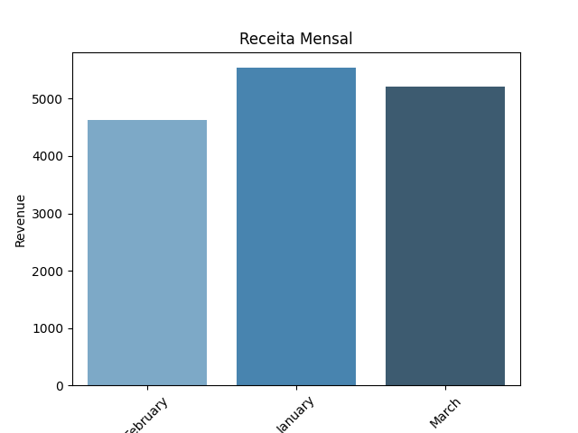
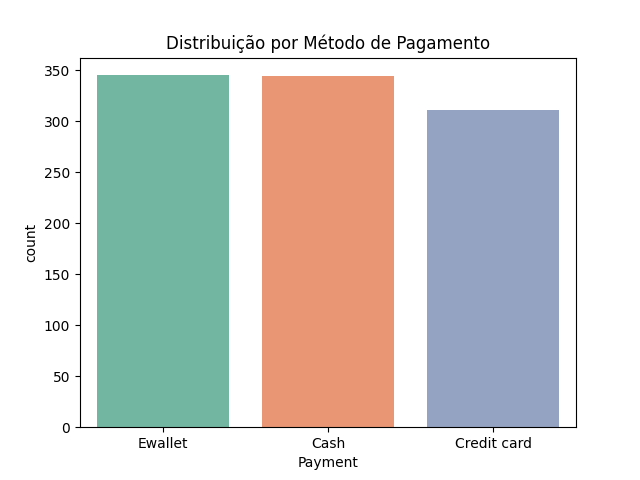

# 🛒 Análise de Vendas e Receita – Supermarket Sales

Projeto de análise exploratória de dados (EDA) utilizando **Pandas, Seaborn e Plotly**.  
O objetivo foi entender tendências de receita, comportamento de clientes e performance de vendas de um supermercado.

---

## 🚀 Objetivos
- Explorar e tratar os dados de vendas.
- Analisar crescimento de receita por período.
- Identificar comportamento de clientes (novos x recorrentes).
- Destacar linhas de produtos mais rentáveis.

---

## 📂 Estrutura

sales-analysis/
│── data/
│ └── supermarket_sales.csv
│── notebooks/
│ └── eda_sales.ipynb
│── src/
│ └── analysis.py
│── requirements.txt
│── README.md

---

## 📊 Insights
- A **receita anual** cresceu em torno de **12%**.  
- **Clientes recorrentes** representaram cerca de **65% do faturamento**.  
- A linha de produtos **Health and beauty** teve forte contribuição nas vendas.  
- O uso de **pagamentos eletrônicos** (Ewallet, cartão) superou o uso de dinheiro.

---

## 📸 Exemplos de Gráficos
  

---

## 📊 Dataset
[Kaggle – Supermarket Sales Dataset](https://www.kaggle.com/datasets/aungpyaeap/supermarket-sales)

---

## 👨‍💻 Autor
Projeto desenvolvido para prática de **Data Analysis com Python**.  
Feito por Daniel
